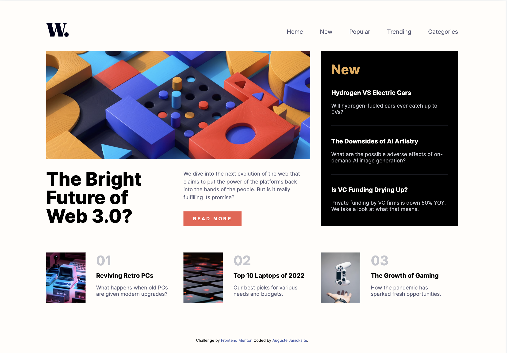
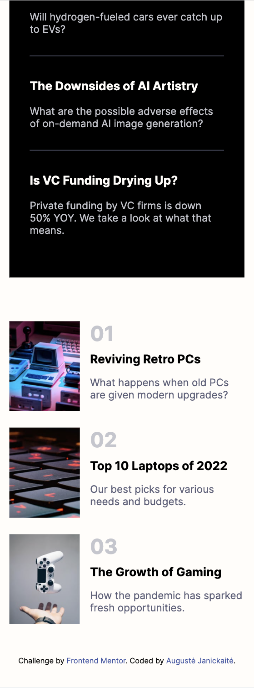

# Frontend Mentor - News homepage solution

This is a solution to the [News homepage challenge on Frontend Mentor](https://www.frontendmentor.io/challenges/news-homepage-H6SWTa1MFl). Frontend Mentor challenges help you improve your coding skills by building realistic projects. 

## Table of contents

- [Overview](#overview)
  - [The challenge](#the-challenge)
  - [Screenshot](#screenshot)
  - [Links](#links)
- [My process](#my-process)
  - [Built with](#built-with)
  - [What I learned](#what-i-learned)
  - [Continued development](#continued-development)
- [Author](#author)

**Note: Delete this note and update the table of contents based on what sections you keep.**

## Overview

### The challenge
- Challenge included examples of 1440px and 375px width screens
- I did not use Pro account features (no Figma, most of design margins/font-size was my best guess)

Users should be able to:

- View the optimal layout for the interface depending on their device's screen size
- See hover and focus states for all interactive elements on the page

### Screenshot 
## My work (1440px)

## Original challenge template I copied (1440px)

## My work (375px)

## Original challenge template I copied (375px)

### Links

- Live Site URL: [(https://augustej.github.io/FEnd-Mentor-News-Home/)]

## My process

### Built with

- Semantic HTML5 markup
- CSS custom properties
- Flexbox
- CSS Grid
- Mobile-first workflow

### What I learned

- I have practised CSS grid, which is always a challenge, since I am more into flexbox.
- How to center an item among horizontal and vertical axis without flex/grid, if I have height of it. 
    .centered-item-css{
      position:absolute;
      top: calc((100vh - {height})/2);
      right:0;
      left:0;
      margin:0 auto;
    }
- Practised burger menu (display/hide elements)

### Continued development

The best way to learn is to practise. I wish to continue learning CSS grid in more complex challenges.

## Author

- Frontend Mentor - [@augustej](https://www.frontendmentor.io/profile/augustej)